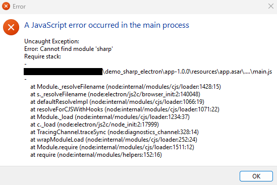
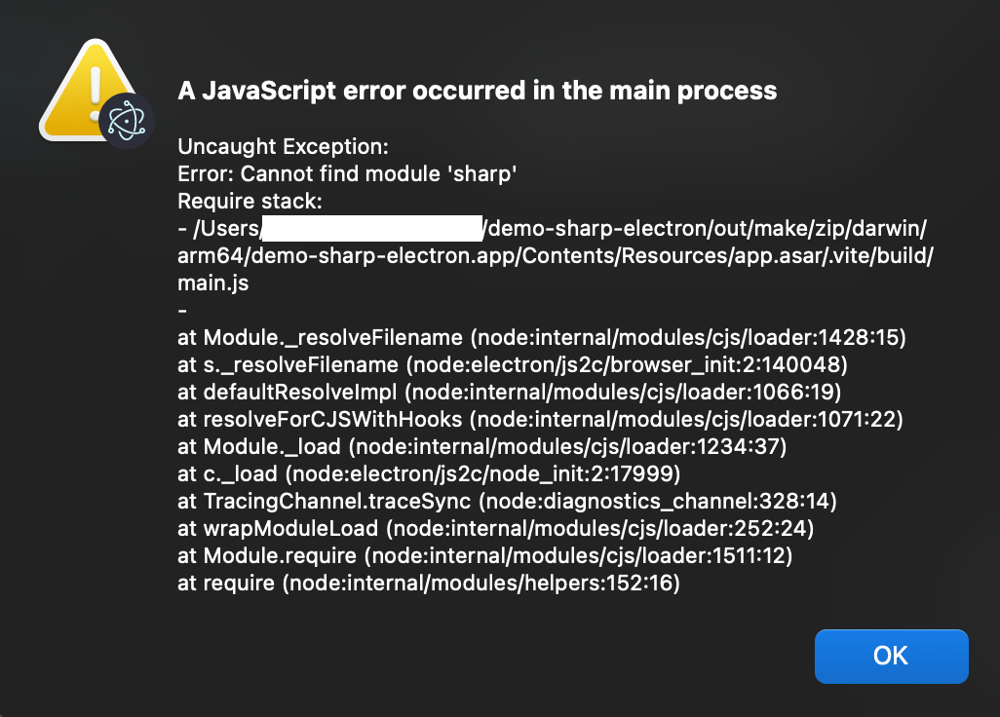

# Electron Forge ft. Sharp issue

This is a repro repository for an issue regarding Electron Forge and Sharp library.

Issue: https://github.com/electron/forge/issues/4144

> A workaround has been provided by [samwisekind](https://github.com/electron/forge/issues/4144#issuecomment-3921605268), which recommended to use [`forge-externals-plugin`](@timfish/forge-externals-plugin). Even if the docs only mention *Webpack*, it also works fine with *Vite*.

## Objective

Make a desktop Electron app for Windows and MacOS able to process images using the Sharp library.

## Problem

Running the application as developer (with `npm run start`) works as expected. You will see an image being generated in `public/sharp-image.png`.

To build the app, you can use `npm run make`, and eveything seems fine. But when you open the resulting application executable, you will see this error:

## Using this project

1. Install [Node.js](https://nodejs.org). The project has been made with *Node 24+*, but it will likely works with previous versions.
2. Install dependencies with `npm i`
3. Rebuild Sharp binaries with `npx @electron/rebuild -f -w sharp`. It's expected that this command produces the binaries, but nothing will actually happen. Which is part of the issue, I guess.
4. Run the application with `npm run start`

### Build and run

Build the app with `npm run make`.

After the build is successful, go to `./out/make/...` then down to the ZIP or executable depending on your platform.